 

 

 

 

 

---

## Sobre

Engenheiro de Software Full-Stack. Desenvolvo sistemas web, SaaS, APIs e integracoes conectando front-end, back-end, banco de dados, requisitos e testes para entregar software estavel em producao.

Na **Fagron Tech**, atuo com servicos internos, APIs, RabbitMQ, SQL/Firebird, Azure DevOps e analise de codigo Delphi. Pela **[Aithos Tech](https://aithostech.com.br)**, construo produtos digitais full-stack do planejamento ao deploy, incluindo o **[Lucro Certo](https://lucrocerto.cloud)** em producao.

**7+** projetos publicados &nbsp;|&nbsp; **3** incidentes criticos analisados com RCA &nbsp;|&nbsp; **2** empresas simultaneas

---

## Produto em Producao — Lucro Certo

**[Lucro Certo](https://lucrocerto.cloud)** e um SaaS de **precificacao inteligente e gestao financeira** para negocios de alimentacao (restaurantes, food trucks, confeitarias, dark kitchens).

| Funcionalidade | Descricao |
|---|---|
| **Precificacao Inteligente** | Calcula o preco ideal: ingredientes, embalagens, taxas e perdas |
| **Gestao Financeira Completa** | Acompanha receitas, despesas e margem em tempo real |
| **Agente IA** | Consultor financeiro que analisa numeros e sugere acoes |
| **Integracao iFood** | Puxa pedidos automaticamente e deduz taxas para exibir o lucro real |
| **Relatorios e DRE** | Exportacao PDF, simulador de cenarios e relatorios avancados |
| **LGPD Compliant** | Dados protegidos com exportacao e exclusao de conta |

Stack: **Next.js · React 19 · Node.js · PostgreSQL · Supabase · Stripe · Groq AI · iFood API**

### Arquitetura

```mermaid
flowchart TB
    subgraph CLIENTE["Cliente - Browser / PWA"]
        UI["Next.js App Router - React 19 - Tailwind - PWA"]
    end
    subgraph EDGE["Edge Middleware"]
        E1{"Rota sensivel?"} -->|sim| E1R["404 imediato"]
        E1 -->|nao| E2{"Sessao valida?"}
        E2 -->|nao| EFAST["Fast-path sem auth"]
        E2 -->|sim| E3["Valida usuario"] --> E4{"Autenticado?"}
        E4 -->|nao| E4R["redirect /login"]
        E4 -->|sim| E5{"Exige assinatura?"}
        E5 -->|sim| E6{"Assinatura ativa?"} -->|nao pag.| E6P["redirect /planos"]
        E6 -->|nao API| E6A["402 SUBSCRIPTION_REQUIRED"]
        E6 -->|sim| EHDRS
        E5 -->|nao| EHDRS
        EFAST --> EHDRS["Headers: CSP - HSTS - X-Frame-Options"]
    end
    subgraph AUTH["Autenticacao"]
        AC["Cadastro: anti-enumeracao - captcha - LGPD"]
        AL["Login: valida credenciais - sincroniza plano"]
    end
    subgraph TRIAL["Trial"]
        TR1{"Assinatura existe?"} -->|nao| TR2["Cria: basico - 7 dias - 1 por conta"]
        TR1 -->|sim| TR3["Mantem estado atual"]
        TR2 --> TR4{"Trial expirado?"} -->|nao| TR6["Acessa o app"]
        TR4 -->|sim| TR5["Paywall - redirect /planos"]
    end
    subgraph BILLING["Billing - Stripe"]
        BCO["Checkout: cria sessao - referencia ao usuario"]
        BWH["Webhook: valida assinatura - idempotente"] --> BEV{"Evento"}
        BEV -->|assinatura criada/atualizada| BACT["Atualiza plano - ativa assinatura"]
        BEV -->|pagamento falhou| BGRC["Periodo de carencia"]
        BEV -->|assinatura cancelada| BCAN["Plano cancelado - volta ao basico"]
    end
    subgraph CHAT["IA Chat - Basico e Pro"]
        CH1["Sanitiza entrada - verifica limite"] --> CH2["LLM stream SSE"] --> CH3{"Produto detectado?"}
        CH3 -->|sim| CH4["Valida schema - calcula - salva produto"] --> CH5["Salva historico"]
        CH3 -->|nao| CH5
    end
    subgraph AGENTE["IA Agente - Pro"]
        AGR{"Plano?"} -->|Basico| AGBL["403 - Upgrade necessario"]
        AGR -->|Pro| AGL["Executa loop com contexto"] --> AGT{"LLM precisa tool?"}
        AGT -->|leitura| AGTL["Executa tool"] --> AGL
        AGT -->|acao| AGTA["Propoe acao - aguarda confirmacao"]
        AGT -->|final| AGTS["Stream SSE - salva historico"]
    end
    subgraph LLM["Cliente LLM - Resiliencia"]
        GC1{"Slot disponivel?"} -->|nao| GCQ["Fila FIFO - backpressure"] -.->|liberado| GC1
        GC1 -->|sim| GCR["Round-robin entre chaves"] --> GCS["Chama API - timeout 120s"] --> GCO{"Resultado"}
        GCO -->|ok| GCOK["Retorna stream"] --> GCREL["Libera slot"]
        GCO -->|rate limit| GCC["Cooldown na chave"] --> GCN{"Outra chave?"}
        GCO -->|erro| GCN
        GCN -->|sim| GCR
        GCN -->|nao| GCFAIL["Degrada graciosamente"] --> GCREL
    end
    subgraph IFOOD["iFood - Conexao e Sync"]
        ICS["Device flow OAuth"] --> ICF["Troca tokens - salva criptografado"] --> ICM["Vincula estabelecimento"]
        IS1["Polling de eventos"] -->|expirado| ISR["Renova token"] --> IS1
        IS1 -->|eventos| IS2["Processa pedidos"] --> IS4["Busca detalhes - retry 404"]
        IS4 --> IS5{"Cancelamento?"} -->|sim| IS6["CANCELLED - excluido da receita"]
        IS5 -->|nao| IS7["Salva status"]
        IS6 --> IS8["Salva pedido - metricas"] --> IS9["Confirma para o iFood"]
        IS7 --> IS8
    end
    subgraph NEGOCIO["CRUD - Produtos Vendas Custos"]
        NL{"Limite do plano?"} -->|excedido| NLE["403 PLAN_LIMIT_REACHED"]
        NL -->|ok| NW["Escreve no banco - isolado por usuario"] --> NA["Auditoria - nao bloqueia"]
    end
    subgraph CALC["Motor de Calculos"]
        CLP["Precificacao: custo - preco sugerido - break-even - markup"]
        CLD["DRE: Receita - Custos - Fixos = Lucro - alertas"]
    end
    subgraph SEC["Seguranca - Defesa em Camadas"]
        S1["Camada 1 - Borda: CSP - HSTS - paywall"] --> S2["Camada 2 - Rota: rate limit - Zod - sem IDOR"] --> S3["Camada 3 - Banco: RLS por usuario"]
    end
    subgraph SB["Supabase - Postgres + RLS"]
        DB[("usuarios - assinaturas - produtos - vendas - pedidos iFood - historico chat - audit logs")]
    end
    subgraph EXT["Servicos Externos"]
        STRIPE_E["Stripe - Webhooks assinados"]
        GROQ_E["Groq API - LLMs open-weight"]
        IFOOD_E["iFood API - OAuth + polling"]
        TURN_E["Cloudflare Turnstile - Captcha"]
    end
    CLIENTE -->|HTTPS| EDGE
    EDGE --> AUTH & TRIAL & BILLING & CHAT & AGENTE & IFOOD & NEGOCIO
    CHAT --> LLM
    AGENTE --> LLM
    LLM -->|stream| GROQ_E
    NEGOCIO --> CALC
    AUTH --> SB
    TRIAL --> SB
    BILLING --> SB
    CHAT --> SB
    AGENTE --> SB
    IFOOD --> SB
    NEGOCIO --> SB
    AC --> TURN_E
    BCO --> STRIPE_E -.->|webhook| BWH
    IFOOD --> IFOOD_E
    SEC -.-> EDGE
    SEC -.-> NEGOCIO
    SEC -.-> SB
```

---

## Cases

| # | Projeto | Papel | Stack |
|---|---|---|---|
| **01** | **[PME OS](https://pmeos-tech.netlify.app)** — SaaS multitenant com RLS, IA generativa por tenant e pagamentos | Arquitetura, dev full-stack, integracoes, testes E2E | Next.js 14 · TypeScript · Supabase · Groq AI · Asaas · Playwright |
| **02** | **[Lucro Certo](https://lucrocerto.cloud)** — Precificacao inteligente para MEIs do setor alimenticio | Dev full-stack, SaaS, IA conversacional, freemium, pagamentos | Next.js · TypeScript · Supabase · Groq AI · Stripe |
| **03** | **[Aithos LabCode](https://github.com/Nathan-Paranhos)** — Bancada desktop para engenharia de software | Arquitetura, interface, modulos, publicacao open source | Electron · Node.js · TypeScript |

---

## Experiencia

### Engenheiro de Software (Estagio) · Fagron Tech
**fev. 2026 - atual** · Sao Paulo, SP · Engenharia de Software

- Validacao e refinamento de requisitos funcionais, regras de negocio e criterios de aceite
- Investigacao de incidentes em producao com analise de logs, SQL/Firebird e RCA
- Validacao de integracoes entre APIs, payloads, contratos e filas com RabbitMQ
- Testes funcionais/regressivos e validacao pos-implantacao em ambiente produtivo
- Gestao de demandas com Azure DevOps, Kanban, plannings e retrospectivas
- Analise de codigo legado em Delphi para correcoes, estabilizacao e documentacao

     

---

### Fundador & Engenheiro de Software · Aithos Tech
**2025 - atual** · Jundiai, SP · [aithostech.com.br](https://aithostech.com.br)

- Ciclo completo de produtos digitais: requisitos, arquitetura, dev full-stack, integracoes e deploy
- Desenvolvimento do PME OS (SaaS multitenant com RLS, IA e pagamentos)
- Desenvolvimento e manutencao do Lucro Certo em producao
- Entrega de projetos para clientes: SaaS, landing pages, dashboards e sites
- Testes E2E com Playwright e documentacao tecnica

    

---

### Software Support (Estagio) · Fagron Tech
**abr. 2025 - fev. 2026** · Sao Paulo, SP

- Lideranca em projetos de implantacao de ERP/CRM e homologacao de sistemas
- Consultas e validacoes em banco Firebird/SQL para sustentacao e decisao tecnica
- Automacao de processos internos com Power Automate e SharePoint
- Gestao de backlog com Monday, Azure DevOps e Microsoft Project
- Experiencia com Microsoft Dynamics 365 e mapeamento de processos

   

---

### Assistente ADM / TI · Abrylar Imoveis
**ago. 2023 - jan. 2025** · Jundiai, SP

- Automacao de tarefas repetitivas, relatorios e organizacao de dados
- Suporte em sistemas de gestao imobiliaria e atendimento a usuarios
- Desenvolvimento de landing pages responsivas e dashboards de indicadores

  

---

## Projetos

| # | Projeto | Descricao | Stack |
|---|---|---|---|
| 01 | **[KV Cache QJL](https://github.com/Nathan-Paranhos)** | Simulacao de compressao de KV Cache com rotacao Johnson-Lindenstrauss e quantizacao polar | C# · .NET 8 · WinForms |
| 02 | **[Loja Fake API](https://github.com/Nathan-Paranhos)** | Catalogo com Fake Store API, custom hooks, service layer, filtros e carrinho | React 18 · TypeScript · Vite · Puppeteer |
| 03 | **[GroqNote v1](https://github.com/Nathan-Paranhos)** | Editor Markdown e testador REST com analise por IA, persistencia local e MVVM | C# · .NET 8 · Avalonia UI · Groq API |
| 04 | **LaudoBot** | Geracao de laudos em PDF via WhatsApp com validacao e organizacao automatica | Node.js · Evolution API · Firebase · PDFKit |
| 05 | **[Visionaria Vistorias](https://visionariavistorias.com.br)** | Landing page responsiva para geracao de leads | Next.js · Tailwind CSS |
| 06 | **[Aithos Tech](https://aithostech.com.br)** | Site institucional com animacoes CSS nativas e identidade visual | Next.js · TypeScript · Tailwind |
| 07 | **[Darlan Goncalves](https://darlan-goncalves.com.br)** | Site pessoal para analista de sistemas com identidade personalizada | Next.js · TypeScript · Tailwind CSS |
| 08 | **[Sobral Credito Seguro](https://sobralcreditoseguro.com.br)** | Site institucional para empresa de credito | Next.js · Tailwind CSS |
| 09 | **TCC Arduino** | Monitoramento de ambiente com Arduino e sensores (projeto academico) | Arduino · C++ · IoT |

---

## Stack

**Front-end**

**Back-end e Integracoes**

**Testes e Qualidade**

**Dados**

**DevOps e Plataformas**

**IA e Automacao**

**Desktop**

**Corporativo**

---

## GitHub Stats

&nbsp;

---

## Formacao

| Periodo | Curso | Instituicao |
|---|---|---|
| 2025 - 2028 | Bacharelado em Engenharia de Software | Universidade Estacio |
| 2021 - 2022 | Tecnico em Tecnologia da Informacao | FAACG |

Ingles: leitura tecnica de documentacoes, APIs e releases; escrita basica para comunicacao.

---

## Contato

Atuo em oportunidades que envolvem front-end, back-end, APIs, banco de dados, automacoes, integracoes e testes.

---

*"Qualidade nao e um ato, e um habito."*

**2026 Nathan Paranhos · Jundiai, SP · [Aithos Tech](https://aithostech.com.br)**

