<div align="center">



<br/>

```
  ███╗   ██╗ █████╗ ████████╗██╗  ██╗ █████╗ ███╗   ██╗
  ████╗  ██║██╔══██╗╚══██╔══╝██║  ██║██╔══██╗████╗  ██║
  ██╔██╗ ██║███████║   ██║   ███████║███████║██╔██╗ ██║
  ██║╚██╗██║██╔══██║   ██║   ██╔══██║██╔══██║██║╚██╗██║
  ██║ ╚████║██║  ██║   ██║   ██║  ██║██║  ██║██║ ╚████║
  ╚═╝  ╚═══╝╚═╝  ╚═╝   ╚═╝   ╚═╝  ╚═╝╚═╝  ╚═╝╚═╝  ╚═══╝
```


<br/>


</div>

---

## 👤 Sobre mim

Sou **Estagiário de Desenvolvimento de Software** na **Fagron Tech** e **Fundador** da **Aithos Tech**, com foco em **estabilidade**, **análise técnica** e **melhoria contínua** de sistemas.

Atuo na **investigação de incidentes em produção**, **Root Cause Analysis (RCA)** e **validação de integrações** entre **APIs REST / GraphQL** e serviços internos, garantindo **confiabilidade** e redução de falhas sistêmicas.

Tenho experiência com **SQL / Firebird** para análise de dados, **monitoramento de fluxos assíncronos com RabbitMQ**, acompanhamento de **deploys** e validação pós-implantação, conectando visão técnica com entendimento profundo de **regras de negócio**.

Perfil **analítico** e **orientado à qualidade**, com vivência em ambientes ágeis (**Scrum** e **Kanban**), colaborando desde o refinamento de requisitos até a entrega em produção.

---

## 🌐 Onde me encontrar

<div align="center">

[](https://nathan-paranhos.com.br/)
[](https://www.linkedin.com/in/nathan-paranhos-55807831a/)
[](https://github.com/Nathan-Paranhos)

</div>

---

## 💼 Experiência Profissional

### 🔬 Fagron Tech — Estagiário de Desenvolvimento de Software
**`Fev/2026 → Presente`**

> Atuação na área de **Product**, garantindo qualidade, estabilidade e evolução contínua do sistema em ambiente produtivo de alta criticidade.

- 🔗 Desenvolvimento e validação de **integrações entre sistemas** via APIs REST e GraphQL
- 🔐 Atuação com **autenticação por token/hash**, validação de contratos e análise de payloads
- 🔎 **Investigação de incidentes em produção** com análise de logs e consultas em SQL/Firebird
- 🧠 Condução de **Root Cause Analysis (RCA)** para prevenção de falhas recorrentes
- 📨 Monitoramento e análise de **fluxos assíncronos com RabbitMQ**
- ✅ Participação na definição e execução de **testes funcionais e regressivos**
- 🚀 Acompanhamento de **deploys** e validação pós-implantação em produção
- 📋 Gestão de demandas com **Kanban** e **Azure DevOps**
- 📝 Documentação técnica de análises, correções e melhorias implementadas

---

### 🛠 Fagron Tech — Estagiário de Suporte de Software
**`Abr/2025 → Fev/2026`**

> Implantação, suporte e sustentação de sistemas ERP e CRM, com foco em qualidade, documentação e cumprimento de prazos.

- 🏗 Liderança em projetos de **implantação de ERP e CRM**
- 🗄 Consultas, análises e validações em **banco de dados Firebird**
- ⚡ Automação de fluxos corporativos com **Power Automate**, Dynamics 365 e SharePoint
- ⚙️ Configuração, parametrização, **homologação** e padronização de sistemas
- 🗂 Gestão de backlog e acompanhamento de entregas com **Azure DevOps** e Monday.com

---

### 🚀 Aithos Tech — Fundador e Desenvolvedor de Software
**`2025 → Presente`**

> Desenvolvimento de soluções digitais para pequenos negócios, startups e projetos próprios — do planejamento ao deploy.

- 💻 Desenvolvimento de **sites, landing pages, dashboards e sistemas web**
- ⚛️ Interfaces responsivas com **React, Next.js, TypeScript** e **Tailwind CSS**
- 🔧 Estruturação de **APIs, integrações** e fluxos entre front-end, back-end e serviços externos
- ☁️ Deploy em **Vercel**, **Netlify** e **Render**
- 🗃 Modelagem de dados com **Firebase**, **Supabase** e **PostgreSQL**
- 🤖 Estudo aplicado de **IA generativa e LLMs** para automações e produtos digitais

---

### 🏢 Abrylar Imóveis — Assistente ADM / TI
**`Ago/2023 → Jan/2025`**

- 🌐 Desenvolvimento e manutenção de **landing pages responsivas**
- ⚙️ Integração e organização de **processos administrativos e tecnológicos**
- 📊 Criação de **dashboards e planilhas** para acompanhamento de indicadores

---

## 🛠 Stack Técnica

<div align="center">

### Front-end


### Back-end & Integrações


### Banco de Dados


### DevOps & Ferramentas


### Qualidade & Incidentes


</div>

---

## 🚀 Projetos em Destaque

| Projeto | Stack | Link |
|---|---|---|
| 🏛 **Aithos Tech** — Site institucional / Tech Studio | React · Next.js · TypeScript · Tailwind | [aithostech.com.br](https://aithostech.com.br) |
| 🔍 **Visionária Vistorias** — Landing page profissional | React · Next.js · Tailwind CSS | [visionariavistorias.com.br](https://visionariavistorias.com.br) |
| 💰 **Sobral Crédito Seguro** — Landing page financeira | HTML · CSS · JavaScript | [sobralcreditoseguro.com.br](https://sobralcreditoseguro.com.br) |
| ⚙️ **Repositórios Abertos** — Scripts, automações e experimentos | JS · TS · Python · Node.js | [github.com/Nathan-Paranhos](https://github.com/Nathan-Paranhos) |

---

## 🎓 Formação Acadêmica

| Curso | Instituição | Período |
|---|---|---|
| 🎓 Engenharia de Software | Universidade Estácio | 2025 – 2028 (em andamento) |
| 🖥 Técnico em T.I. | FAACG | 2021 – 2022 · TCC: automação com Arduino e sensores |

---

## ✅ Destaques Técnicos

```
[ APIs REST ]     Integrações via token/hash · Validação de contrato e payload
[ GraphQL ]       Integrações com Monday.com e serviços externos
[ RabbitMQ ]      Monitoramento e análise de fluxos assíncronos
[ SQL/Firebird ]  Investigação de incidentes · Diagnóstico de inconsistências
[ RCA ]           Root Cause Analysis · Prevenção de falhas recorrentes
[ RPA ]           Automações com Power Automate · Consistência transacional
[ Deploys ]       Acompanhamento de releases · Validação pós-implantação
[ Agile ]         Scrum / Kanban · Refinamentos · Azure DevOps
```

---

## 📊 Atividade no GitHub

<div align="center">


<br/>


</div>

---

<div align="center">


**"Qualidade não é um ato, é um hábito."**

</div>
